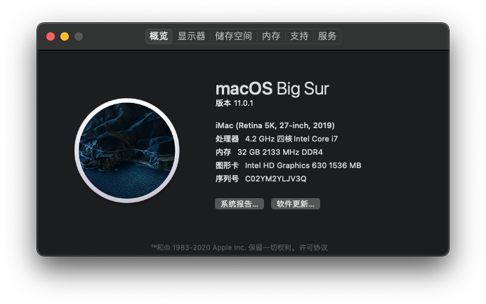
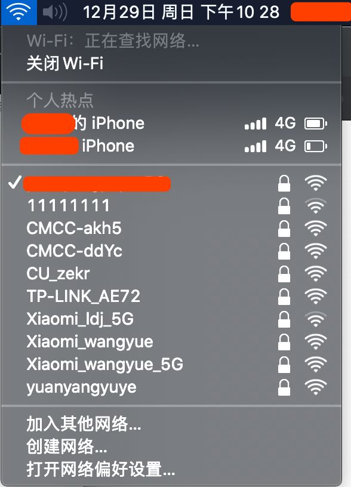
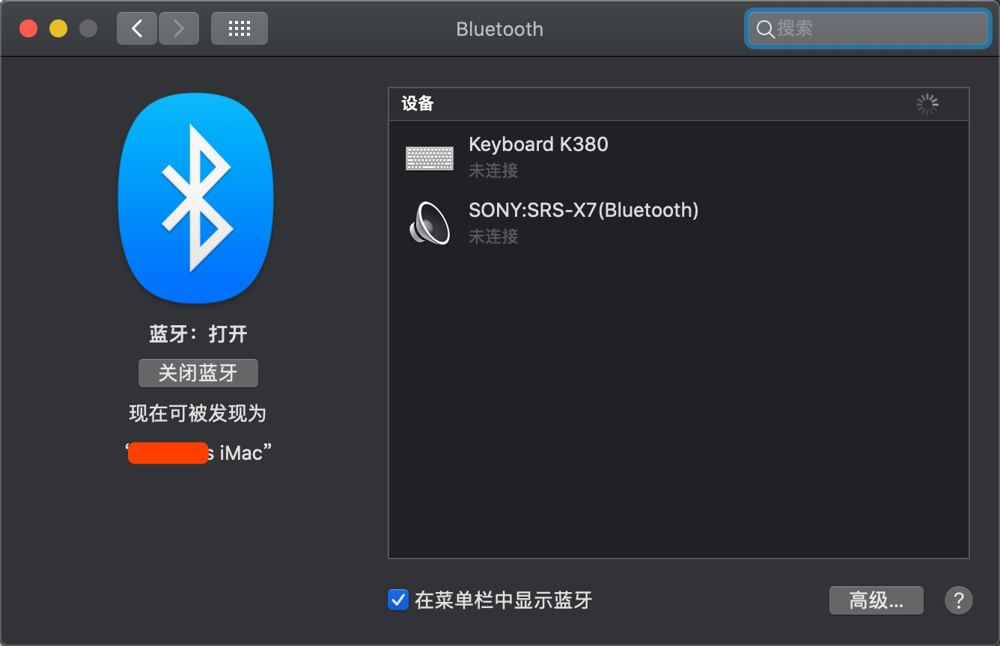

# HacMini:  Z270i + 7700K  + DDR4 3000MHz

### 引导

**Clover Version**： [v2.5k r5070](https://sourceforge.net/projects/cloverefiboot/files/Installer/)

**macOS Version**：macOS Catalina [10.15.2 （19C57）](https://developer.apple.com/documentation/macos_release_notes/macos_catalina_10_15_2_release_notes)

### 配置单

* 主板：华硕® [ROG STRIX Z270-I GAMING](https://www.asus.com.cn/Motherboards/ROG-STRIX-Z270-I-GAMING/)
  * 板载声卡：Realtek ALC S1220A
* CPU：英特尔® 酷睿™ [i7-7700K](https://ark.intel.com/content/www/cn/zh/ark/products/97129/intel-core-i7-7700k-processor-8m-cache-up-to-4-50-ghz.html)
  * 核心显卡：英特尔®  [HD Graphics 630](https://www.intel.com/content/www/us/en/support/products/98909/graphics-drivers/graphics-for-7th-generation-intel-processors/intel-hd-graphics-630.html)
* 硬盘：三星® [PM961-1T](https://www.samsung.com/semiconductor/ssd/client-ssd/MZVLW1T0HMLH/)
* 内存：美商海盗船 复仇者® [32GB (2x16GB) DDR4 3000MHz]([https://www.corsair.com/zh/zh/%E7%B1%BB%E5%88%AB/%E4%BA%A7%E5%93%81/%E5%86%85%E5%AD%98/VENGEANCE-LPX/p/CMK32GX4M2B3000C15](https://www.corsair.com/zh/zh/类别/产品/内存/VENGEANCE-LPX/p/CMK32GX4M2B3000C15))
* 机箱 & 电源：迎广 [肖邦](https://www.in-win.com/cn/gaming-chassis/Chopin)
* WiFi & 蓝牙：戴尔 DW1820A

### 驱动

#### UEFIs

* [AppleSupportPkg - 2.1.4](https://github.com/acidanthera/AppleSupportPkg) 
  * ApfsDriverLoader.efi

* [AptioFixPkg - R27](https://github.com/acidanthera/AptioFixPkg/releases)
  * AptioInputFix.efi
  * AptioMemoryFix.efi

#### KEXTs

* 驱动平台 [Lilu.kext - 1.4.0](https://github.com/acidanthera/Lilu)
  * 声卡驱动 [AppleALC.kext - 1.4.4](https://github.com/acidanthera/AppleALC)
  * 核心显卡驱动 [WhateverGreen.kext - 1.3.5](https://github.com/acidanthera/WhateverGreen)
  * WiFi 驱动 [AirportBrcmFixup.kext - 2.0.4](https://github.com/acidanthera/AirportBrcmFixup)
  * 蓝牙驱动 [BrcmPatchRAM  - 2.5.0](https://github.com/acidanthera/BrcmPatchRAM)
    * BrcmFirmwareData.kext
    * BrcmPatchRAM3.kext
    * BrcmBluetoothInjector.kext
* [FakeSMC.kext]()

### 支持功能

* 显卡、声卡、网卡正常

* 无线：2.4G/5G WiFi 正常、蓝牙外设正常

* [连接互通](https://support.apple.com/zh-cn/HT204681)：支持接力、通用剪贴板、iPhone 蜂窝网络电话、信息转发、智能热点、隔空投送等

  

### 补充说明

现阶段，黑苹果兼容的 2230 型号的无线网卡如：DW1560、DW1830 价位较贵，暂用 DW1820A 代替。

### 截图

**关于本机**

**WiFi**

**BlueTooth**

