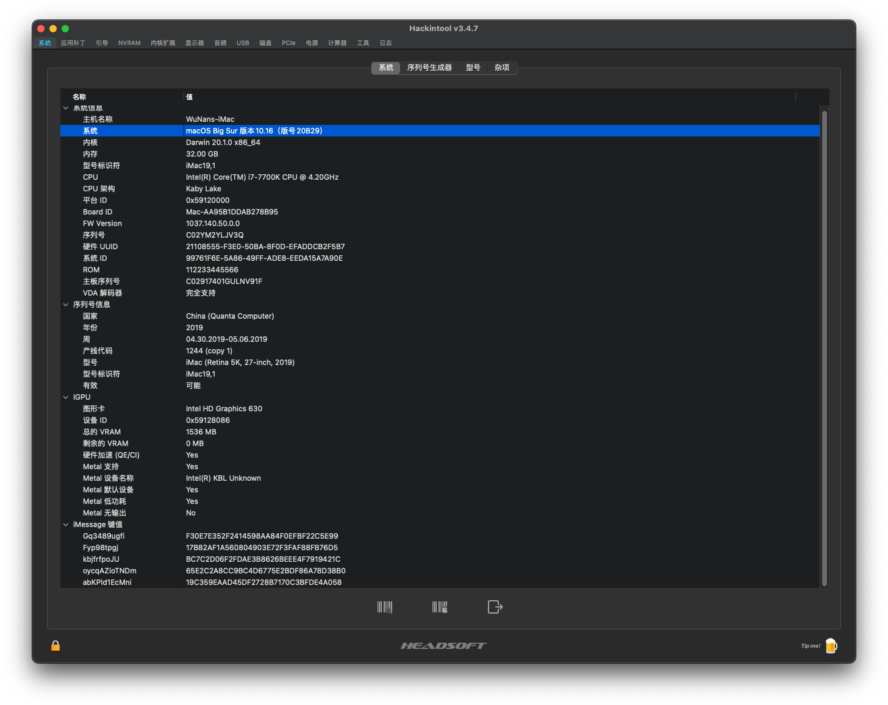
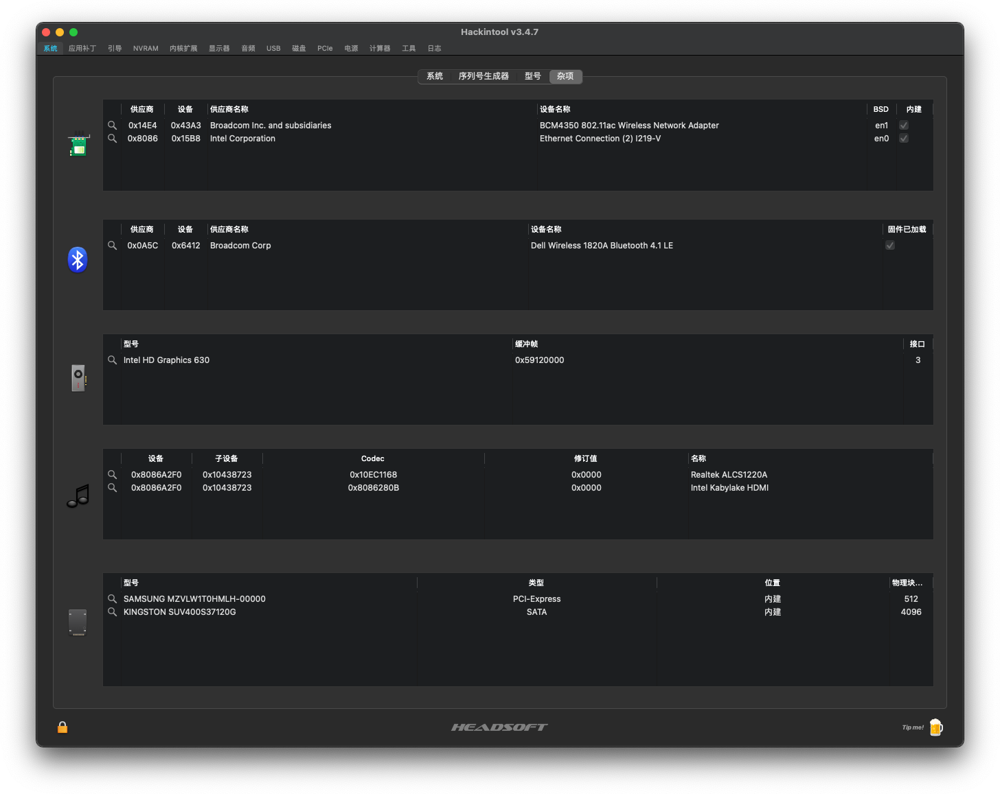
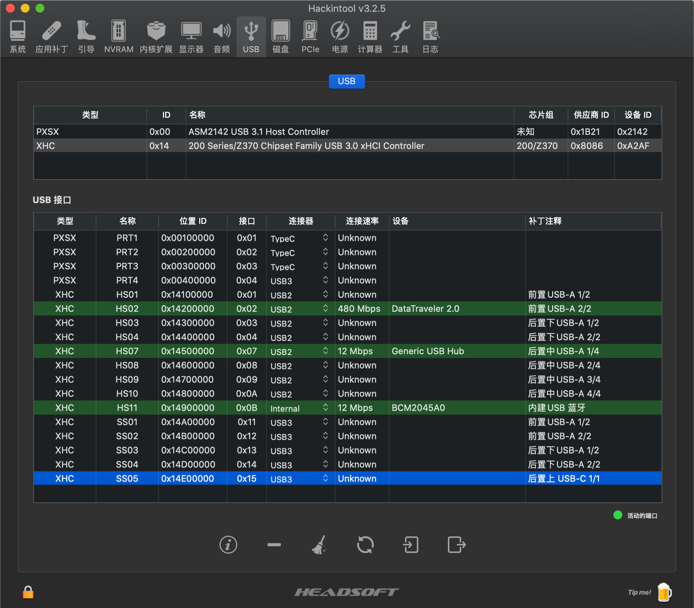

> !!!ATTENTION PLEASE!!!  
> !!!ATTENTION PLEASE!!!  
> !!!ATTENTION PLEASE!!!  
> 因设备升级，此项目不再维护。

# BigSur HacMini:  Z270i + 7700K

> OpenCore EFI

### 引导

**OpenCore Version**： [0.6.3](https://github.com/acidanthera/OpenCorePkg/releases)

**macOS Version**：Catalina 10.15.6 ~ Big Sur 11.1

### 配置单

* 主板：华硕® [ROG STRIX Z270-I GAMING](https://www.asus.com.cn/Motherboards/ROG-STRIX-Z270-I-GAMING/)
  * 板载声卡：Realtek ALC S1220A
* CPU：英特尔® 酷睿™ [i7-7700K](https://ark.intel.com/content/www/cn/zh/ark/products/97129/intel-core-i7-7700k-processor-8m-cache-up-to-4-50-ghz.html)
  * 核心显卡：英特尔®  [HD Graphics 630](https://www.intel.com/content/www/us/en/support/products/98909/graphics-drivers/graphics-for-7th-generation-intel-processors/intel-hd-graphics-630.html)
* 硬盘：三星® [PM961-1T](https://www.samsung.com/semiconductor/ssd/client-ssd/MZVLW1T0HMLH/)
* 内存：美商海盗船 复仇者® [32GB (2x16GB) DDR4 3000MHz]([https://www.corsair.com/zh/zh/%E7%B1%BB%E5%88%AB/%E4%BA%A7%E5%93%81/%E5%86%85%E5%AD%98/VENGEANCE-LPX/p/CMK32GX4M2B3000C15](https://www.corsair.com/zh/zh/类别/产品/内存/VENGEANCE-LPX/p/CMK32GX4M2B3000C15))
* 机箱 & 电源：迎广 [肖邦](https://www.in-win.com/cn/gaming-chassis/Chopin)
* WiFi & 蓝牙：戴尔 DW1820A

### 驱动

### ACPI

* [SSDT-EC-USBX-DESKTOP.aml](https://github.com/dortania/Getting-Started-With-ACPI/blob/master/extra-files/compiled/SSDT-EC-USBX-DESKTOP.aml)
* [SSDT-PLUG-DRTNIA.aml](https://github.com/dortania/Getting-Started-With-ACPI/blob/master/extra-files/compiled/SSDT-PLUG-DRTNIA.aml)

#### UEFIs

* [HfsPlus.efi](https://github.com/acidanthera/OcBinaryData/blob/master/Drivers/HfsPlus.efi)
  
* [OpenCorePkg - 0.6.3](https://github.com/acidanthera/OpenCorePkg)
  * 内置 OpenRuntime.efi

#### KEXTs

* 驱动平台 [Lilu.kext - 1.4.9](https://github.com/acidanthera/Lilu)
* 声卡驱动 [AppleALC.kext - 1.5.4](https://github.com/acidanthera/AppleALC)
* 核心显卡驱动 [WhateverGreen.kext - 1.4.4](https://github.com/acidanthera/WhateverGreen)
* WiFi 驱动 [AirportBrcmFixup - 2.1.1](https://github.com/acidanthera/AirportBrcmFixup)
  * AirportBrcmFixup.kext
  * [AirPortBrcm4360_Injector.kext](https://github.com/acidanthera/AirportBrcmFixup/tree/master/Resources)
  * [AirPortBrcmNIC_Injector.kext](https://github.com/acidanthera/AirportBrcmFixup/tree/master/Resources)
* 蓝牙驱动 [BrcmPatchRAM  - 2.5.5](https://github.com/acidanthera/BrcmPatchRAM)
  * BrcmFirmwareData.kext
  * BrcmPatchRAM3.kext
  * BrcmBluetoothInjector.kext
* USB 驱动：USBPort.kext
* [VirtualSMC.kext - 1.1.1](https://github.com/acidanthera/VirtualSMC/releases)
  * SMCProcessor.kext
  * SMCSuperIO.kext
* 有线网卡：[IntelMausi.kext - 1.0.4](https://github.com/acidanthera/IntelMausi/releases)

### 支持功能

* 显卡、声卡、网卡正常

* 无线：2.4G/5G WiFi 正常、蓝牙外设正常

* [连续互通](https://support.apple.com/zh-cn/HT204681)：支持接力、通用剪贴板、iPhone 蜂窝网络电话、信息转发、智能热点、隔空投送等

* USB 已定制，USB2.0 x 8, USB 3.0 x 5。（后置 TYPE-C 是鸡肋的 USB 3.1 gen1 ，因数量限制，暂未启用）

### 截图

**关于本机**

**Hackintool**

**USB-Customized**

